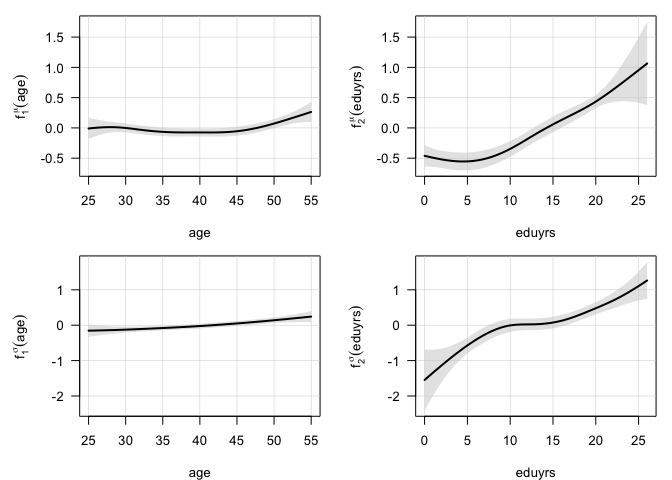
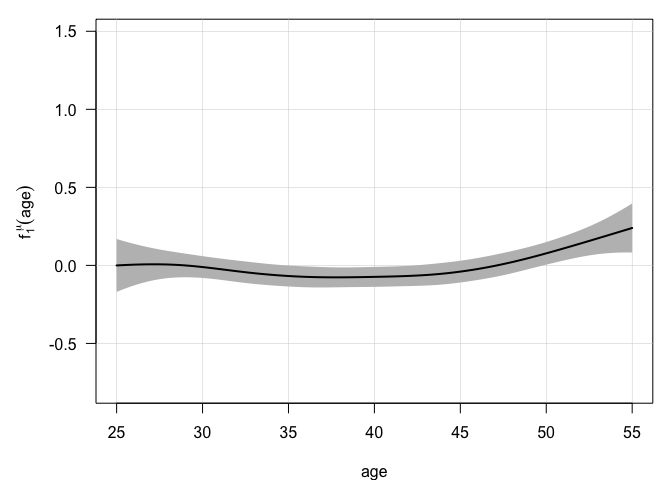
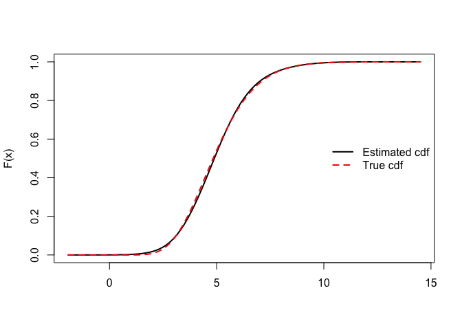

The *DALSM* R-package
================

<!-- ```{r setup, include=TRUE}
%knitr::opts_chunk$set(echo = TRUE)
```
-->

The *DALSM* R-package enables to fit a **nonparametric double
location-scale model to** right- and interval-**censored data**, see
[Lambert (2021)](http://doi.org/10.1016/j.csda.2021.107250) for
methodological details.

Consider a vector $(Y,\mathbf{z},\mathbf{x})$ where $Y$ is a univariate
continuous response, $\mathbf{z}$ a *p*-vector of categorical
covariates, and $\mathbf{x}$ a *J*-vector of quantitative covariates.
The response could be subject to right-censoring, in which case one only
observes $(T,\Delta)$, where $T=\min\{Y,C\}$, $\Delta=I(Y\leq C)$ and
$C$ denotes the right-censoring value that we shall assume independent
of $Y$ given the covariates. The response could also be
interval-censored, meaning that it is only known to lie within an
interval $(Y^L,Y^U)$.

## Model specification

A location-scale model is considered to describe the distribution of the
response conditionally on the covariates,
$$Y = \mu(\mathbf{z},\mathbf{x}) + \sigma(\mathbf{z},\mathbf{x})\varepsilon$$
where $\mu(\mathbf{z},\mathbf{x})$ denotes the conditional location,
$\sigma(\mathbf{z},\mathbf{x})$ the conditional dispersion, and
$\varepsilon$ an error term independent of $\mathbf{z}$ and $\mathbf{x}$
with fixed first and second order moments, $\mathrm{E}(\varepsilon)=0$
and $\mathrm{V}(\varepsilon)=1$.

Assume that independent copies
$(y_i,\mathbf{z}_ i,\mathbf{x}_ i)~(i=1,\ldots,n)$ are observed on $n$
units with the possibility of right or interval-censoring on $y_i$ as
described above. Additive models for the conditional location and
dispersion of the response are specified,
$$\mu(z_i, x_i)= \beta_0+ \Sigma_ {k=1}^p \beta_k z_{ik}+\Sigma_ {j=1} ^{J} {f_j ^{\mu}}(x_ {ij})$$
$$\log\sigma(z_i,x_i)= \delta_0+\Sigma_ {k=1}^p \delta_k z_ {ik}+\Sigma_ {j=1}^{J} {{f_{j}^{\sigma}}}(x_ {ij})$$
where $f_{j}^{\mu}(\cdot)$ and $f_{j}^{\sigma}(\cdot)$ denote smooth
additive terms quantifying the effect of the $j {th}$ quantitative
covariate on the conditional mean and dispersion. The additive terms in
the conditional location and dispersion models can be approximated using
linear combinations of (recentered) B-splines,
$$f^ {\mu}_ j=\left(\Sigma_ {\ell=1}^L {b_ {j\ell}}(x_ {ij})\theta_ {\ell j}^\mu\right)_ {i=1}^n=\mathbf{B}_ j\pmb{\theta}_ j^\mu$$
$$f^ {\sigma}_ j=\left(\Sigma_ {\ell=1}^L {b_ {j\ell}}(x_ {ij})\theta_ {\ell j}^\sigma\right)_ {i=1}^n = \mathbf{B}_ j\pmb{\theta}_ j^\sigma$$
where $[\mathbf{B}_ j]_ {i\ell}={b_{ j\ell}}(x_ {ij})$.

Gaussian Markov random field (GMRF) priors penalizing changes in
neighbour B-spline parameters are taken,
$$p(\pmb{\theta}^ {\mu}_ {j}|\lambda_ j^\mu) \propto \exp\left( -{1\over 2}{\pmb{\theta}^ \mu_ j}^ \top (\lambda^ {\mu}_ j\mathbf{P}^ \mu) \pmb{\theta}^ \mu_ j \right)$$
$$p(\pmb{\theta}^ {\sigma}_ {j}|\lambda_ j^\sigma) \propto \exp\left( -{1\over 2}{\pmb{\theta}^ \sigma_ j}^ \top (\lambda^ {\sigma}_ j\mathbf{P}^ \sigma) \pmb{\theta}^ \sigma_ j \right) $$

where $\mathbf{P}^ \mu, \mathbf{P}^ \sigma$ are penalty matrices and
$\lambda^ {\mu}_ {j},\lambda^ {\sigma}_ {j}$ positive penalty parameters
for the location and dispersion submodels, respectively. For penalty
matrices of order 2, increasingly large values for these parameters
point to linear effects for the additive terms.

## Nonparametric error density

The error term $\varepsilon$ is assumed to have fixed first and second
order moments, $\mathrm{E}(\varepsilon)=0$ and
$\mathrm{V}(\varepsilon)=1$. To get away from the constraining and
sometimes unrealistic normality hypothesis, a flexible form based on
P-splines is indirectly assumed for the error density through the log of
the hazard function. Lagrange multipliers are used to force mean and
variance constraints. We refer to Section 2.5 and Algorithm 3 in
[Lambert (2021)](http://doi.org/10.1016/j.csda.2021.107250) for more
details and to function **densityLPS** in the **DALSM** package for
computational aspects to handle right- and interval-censored data.

## Selection of penalty parameters

Marginal posterior distributions of the penalty parameters in the error
density and in the location and dispersion submodels are approximated by
starting from the following identity,
$$p(\pmb{\lambda} | {\cal D}) = {p(\pmb{\psi},\pmb{\lambda}|{\cal D}) \over p(\pmb{\psi}|\pmb{\lambda},{\cal D})}$$
where $\lambda$ and $\pmb{\psi}$ generically denote the penalty and the
penalized parameters. Thanks to the GMRF prior for
$(\pmb{\psi}|\lambda)$, a Laplace approximation to the conditional
posterior in the numerator is relevant. When that expression is
evaluated at the conditional posterior mode $\hat\psi_ \lambda$, one
obtains the following approximation to the marginal posterior of the
penalty parameters
$$\tilde p (\pmb{\lambda} | {\cal D}) \propto p(\hat\psi_ \lambda, \pmb{\lambda} | {\cal D}) |\Sigma_ \lambda|^ {1/2}$$

where $\Sigma_\lambda$ denotes the conditional variance-covariance
matrix. The mode of $\tilde{p}(\pmb{\lambda}|{\cal D})$ could be chosen
if point values for the penalty parameters are desired. The combination
of Bayesian P-splines with the preceding approximation to the marginal
posterior of $\pmb{\lambda}$ is shortly named *Laplace P-splines*.

## Model fitting

Model fitting alternates the estimation of the regression and spline
parameters in the location-scale model (see Algorithm 1 in [Lambert
2021](http://doi.org/10.1016/j.csda.2021.107250)), the selection of the
penalty parameters (see Algorithm 2) and the update of the error density
(see Algorithm 3). The whole procedure is implemented in function
**DALSM** of the package.

## The *DALSM* package in action

### Application to survey data

The data of interest come from the European Social Survey (ESS 2016)
with a focus on the money available per person in Belgian households for
respondents aged 25-55 when the main source of income comes from wages
or salaries ($n=756$). Each person reports the total net monthly income
of the household in one of 10 decile-based intervals: $1: <1120$
$(n_1=8)$, $2: [1120,1399]$ $(n_2=13)$, $3: [1400,1719]$ $(n_3=47)$,
$4: [1720,2099]$ $(n_4=53)$, $5: [2100,2519]$ $(n_5=82)$,
$6: [2520,3059]$ $(n_6=121)$, $7: [3060,$ $3739]$ $(n_7=167)$,
$8:[3740,4529]$ $(n_8=126)$, $9: [4530,5579]$ $(n_9=74)$,
$10: \geq 5580$ euros $(n_{10}=65)$.

We model the relationship between disposable income per person ($91.4$
percents interval-censored, $8.6$ percents right-censored) and the
availability of (at least) two income ($64.2$ percents) in the
household, as well as the age ($41.0\pm8.83$ years) and number of years
of education completed ($14.9\pm3.34$ years) by the respondent. This
individualized income is obtained by dividing the household one by the
OECD-modified equivalence (Hagenaars1994), as recommended by the
Statistical Office of the European Union (EUROSTAT).

Let us load the package and visualize typical response values:

``` r
## Package installation from R-CRAN
## install.packages("DALSM")
## Alternatively, installation from GitHub:
## install.packages("devtools")
## devtools::install_github("plambertULiege/DALSM")

## Package loading
library(DALSM)

## Data reading
data(DALSM_IncomeData)
resp = DALSM_IncomeData[,1:2]
head(resp,20) ## Visualize first 20 censored income values
```

    ##      inc.low    inc.up
    ## 1  1.5300000 1.8700000
    ## 2  1.1333333 1.3851852
    ## 3  2.0400000 2.4933333
    ## 4  2.4933333 3.0200000
    ## 5  1.8120000 2.2320000
    ## 6  1.7200000 2.1000000
    ## 7  1.7200000 2.1000000
    ## 8  1.7200000 2.1000000
    ## 9  1.2240000 1.4960000
    ## 10 2.4933333 3.0200000
    ## 11 1.7200000 2.1000000
    ## 12 2.0777778 2.5166667
    ## 13 1.4000000 1.7000000
    ## 14 2.0400000 2.4933333
    ## 15 1.8120000 2.2320000
    ## 16 1.1666667 1.4000000
    ## 17 1.6800000 2.0400000
    ## 18 2.1571429 2.6571429
    ## 19 0.5384615 0.6615385
    ## 20 2.6571429       Inf

``` r
summary(DALSM_IncomeData[,3:5]) ## Summary stats for covariates
```

    ##    twoincomes          age            eduyrs     
    ##  Min.   :0.0000   Min.   :25.00   Min.   : 0.00  
    ##  1st Qu.:0.0000   1st Qu.:34.00   1st Qu.:12.00  
    ##  Median :1.0000   Median :41.00   Median :15.00  
    ##  Mean   :0.6415   Mean   :41.03   Mean   :14.88  
    ##  3rd Qu.:1.0000   3rd Qu.:49.00   3rd Qu.:17.00  
    ##  Max.   :1.0000   Max.   :55.00   Max.   :26.00

Most reported income values (in thousand euros) are interval-censored
(with finite values for the upper bound of the interval), some are
right-censored (with an *Inf* value for the upper bound of the interval)
for respondents belonging to households whose net monthly income exceeds
the last decile.

The nonparametric double location-scale model (with additive *age* and
*eduyrs* terms and a fixed effect for the *twoincomes* indicator can be
fitted using the *DALSM* function:

``` r
fit = DALSM(y=resp,
           formula1 = ~twoincomes+s(age)+s(eduyrs),
           formula2 = ~twoincomes+s(age)+s(eduyrs),
           data = DALSM_IncomeData)
print(fit)
```

    ## -----------------------------------------------------------------------
    ##                 Double Additive Location-SCALE Model 
    ## -----------------------------------------------------------------------
    ## Fixed effects for Location:
    ##               est    se   low    up      Z Pval
    ## (Intercept) 1.572 0.062 1.450 1.695 25.234    0
    ## twoincomes  0.252 0.051 0.152 0.352  4.957    0
    ## 
    ## 2 additive term(s) in Location: Eff.dim / Test No effect
    ##        ED.hat   low    up    Chi2 Pval
    ## age     4.247 2.277 4.977  13.839 0.01
    ## eduyrs  3.554 1.811 4.679 118.901 0.00
    ## 
    ## Fixed effects for Dispersion:
    ##                est    se    low     up      Z  Pval
    ## (Intercept) -0.436 0.086 -0.604 -0.268 -5.092 0.000
    ## twoincomes  -0.042 0.070 -0.179  0.094 -0.610 0.542
    ## 
    ## 2 additive term(s) in Dispersion: Eff.dim / Test No effect
    ##        ED.hat   low    up   Chi2  Pval
    ## age     3.318 1.456 4.409 15.249 0.002
    ## eduyrs  3.311 1.508 4.329 41.345 0.000
    ## 
    ## 10  B-splines per additive component in location
    ## 10  B-splines per additive component in dispersion
    ## 20  B-splines for the error density on (-3.76,6.64)
    ## 
    ## Total sample size: 756 ; Credible level for CI: 0.95 
    ## Uncensored data: 0 (0 percents)
    ## Interval Censored data: 691 (91.4 percents)
    ## Right censored data: 65 (8.6 percents)
    ## -----------------------------------------------------------------------
    ## Convergence status: TRUE 
    ## Elapsed time: 0.7 seconds  (5 iterations)
    ## -----------------------------------------------------------------------

It suggests an average increase of 252 euros (available per person in
the household) when the respondent and his/her partner are in paid work
(conditionally on *Age* and *Educ*), while the effect on dispersion is
not statistically significant.  
The effects of *Age* and *Educ* on the conditional mean and dispersion
can be visualized on the plots below with the estimated additive terms.

``` r
plot(fit, new.dev=FALSE)
```

<!-- --><!-- --><!-- -->

The amount of money available per person in the household tends to
decrease with age, see $f_1^\mu(\mathrm{age})$, between approximately 27
and 37 (most likely due the arrival of children in the family) and to
increase after 40 (probably thanks to wage increase with seniority and
the departure of children). The log-dispersion significantly increases
with *Age*, see $f_1^\sigma(\mathrm{age})$, with an acceleration over
30. However, the dominant effect comes from the respondent’s level of
education, with a difference of about 1,000 euros (in expected
disposable income per person) between a less educated (6 years) and a
highly educated (20 years) respondent, see $f_2^\mu(\mathrm{eduyrs})$.
The effect on dispersion is also large, see
$f_2^\sigma(\mathrm{eduyrs})$, with essentially an important contrast
between less and highly educated respondents, the latter group showing
the largest heterogeneity. The estimated density for the error term can
also be seen, with a right-skewed shape clearly distinguishable from the
Gaussian one often implicitly assumed when fitting location-scale
regression models.

### Estimation of a density from censored data

Besides fitting Nonparametric Double Additive Location-Scale Model to
censored data, the DALSM package contains an independent and very fast
function, *densityLPS*, for density estimation from right- or
interval-censored data with possible constraints on the mean and
variance using Laplace P-splines.

Let us generate interval-censored (IC) data from a Gamma(10,2)
distribution with mean 5.0 and variance 2.5. The mean width of the
simulated IC intervals is 2.0. Part of the data are also right-censored
(RC) with RC values generated from an exponential distribution with mean
15.0.

``` r
## Generation of right- and interval-censored data
set.seed(123)
n = 500 ## Sample size
x = rgamma(n,10,2) ## Exact (unobserved) data
width = runif(n,1,3) ## Width of the IC data (mean width = 2)
w = runif(n) ## Positioning of the exact data within the interval
xmat = cbind(pmax(0,x-w*width),x+(1-w)*width) ## Generated IC data
t.cens = rexp(n,1/15) ## Right-censoring values
idx.RC = (1:n)[t.cens<x] ## Id's of the right-censored units 
xmat[idx.RC,] = cbind(t.cens[idx.RC],Inf) ## Data for RC units: (t.cens,Inf)
head(xmat,15)
```

    ##            [,1]     [,2]
    ##  [1,] 0.8279792      Inf
    ##  [2,] 6.6526685 8.204466
    ##  [3,] 1.1579633      Inf
    ##  [4,] 4.1784981 6.277058
    ##  [5,] 6.6143492 8.306603
    ##  [6,] 3.7696512 5.799582
    ##  [7,] 2.4766237      Inf
    ##  [8,] 2.3888812 4.441426
    ##  [9,] 5.9867783 7.392858
    ## [10,] 3.6321041      Inf
    ## [11,] 4.7570358 6.498024
    ## [12,] 4.3883940 5.995044
    ## [13,] 2.0614651      Inf
    ## [14,] 5.1459398      Inf
    ## [15,] 3.3849118      Inf

The density can be estimated from the censored data using function
*densityLPS*. Optionally, the mean and variance of the estimated density
can also be forced to some fixed values, here 5.0 and 2.5, respectively.
We also choose to force the left end of the distribution support to be
0:

``` r
## Density estimation from IC data 
obj.data = Dens1d(xmat,ymin=0) ## Prepare the IC data for estimation
obj = densityLPS(obj.data, Mean0=10/2, Var0=10/4) ## Estimation with fixed mean and variance
print(obj)
```

    ## -----------------------------------------------------------------------
    ##    Constrained Density/Hazard estimation from censored data using LPS  
    ## -----------------------------------------------------------------------
    ## INPUT:
    ##   Total sample size:  500 
    ##   Uncensored data: 0 (0 percents)
    ##   Interval-censored (IC) data: 367 (73.4 percents)
    ##   Right-censored (RC) data: 133 (26.6 percents)
    ##   ---
    ##   Range of the IC data: (0.1708629,12.56085)
    ##   Range of the RC data: (0.009145886,7.785088)
    ##   ---
    ##   Assumed support: (0,14.69175)
    ##   Number of small bins on the support: 501 
    ##   Number of B-splines: 25 ; Penalty order: 2 
    ## 
    ## OUTPUT:
    ##   Returned functions:  ddist, pdist, hdist, Hdist(x)
    ##   Parameter estimates:  phi, tau
    ##   Value of the estimated cdf at +infty: 1 
    ##   Constraint on the Mean: 5  ; Fitted mean: 5 
    ##   Constraint on the Variance: 2.5  ; Fitted variance: 2.499669 
    ##   Selected penalty parameter <tau>: 22.5 
    ##   Effective number of parameters: 5.4 
    ## -----------------------------------------------------------------------
    ## Elapsed time: 0.1 seconds  (6 iterations)
    ## -----------------------------------------------------------------------

The estimated density and cdf can also be visualized and compared to
their ‘true’ Gamma(10,2) counterparts used to generate the data:

``` r
plot(obj) ## Plot the estimated density
curve(dgamma(x,10,2), ## ... and compare it to the true density (in red)
      add=TRUE,col="red",lwd=2,lty=2)
legend("topright",col=c("black","red"),lwd=c(2,2),lty=c(1,2),
        legend=c("Estimated density","True density"),bty="n")
```

<!-- -->

``` r
## Same story for the cdf
with(obj, curve(pdist(x),ymin,ymax,lwd=2,xlab="",ylab="F(x)"))
curve(pgamma(x,10,2),add=TRUE,col="red",lwd=2,lty=2)
legend("right",col=c("black","red"),lwd=c(2,2),lty=c(1,2),
        legend=c("Estimated cdf","True cdf"),bty="n")
```

<!-- -->

Estimated density (pdf), distribution (cdf), hazard and cumulative
hazard functions are also directly available:

``` r
xvals = seq(2,10,by=2)
with(obj, cbind(x=xvals, fx=ddist(xvals), Fx=pdist(xvals), 
                hx=hdist(xvals), Hx=Hdist(xvals)))
```

    ##       x          fx         Fx         hx         Hx
    ## [1,]  2 0.031622032 0.01849226 0.03221816 0.01866538
    ## [2,]  4 0.234756524 0.26468056 0.31927749 0.30745026
    ## [3,]  6 0.186674735 0.76413790 0.79144393 1.44450795
    ## [4,]  8 0.037761707 0.95797288 0.89847167 3.16944027
    ## [5,] 10 0.006598059 0.99509435 1.34498959 5.31736848

## License

**DALSM**: Nonparametric Double Additive Location-Scale Model (DALSM).
Copyright (C) 2021-2023 Philippe Lambert

This program is free software: you can redistribute it and/or modify it
under the terms of the GNU General Public License as published by the
Free Software Foundation, either version 3 of the License, or (at your
option) any later version.

This program is distributed in the hope that it will be useful, but
WITHOUT ANY WARRANTY; without even the implied warranty of
MERCHANTABILITY or FITNESS FOR A PARTICULAR PURPOSE. See the GNU General
Public License for more details.

You should have received a copy of the GNU General Public License along
with this program. If not, see <https://www.gnu.org/licenses/>.

## References

\[1\] Lambert, P. (2021) Fast Bayesian inference using Laplace
approximations in nonparametric double additive location-scale models
with right- and interval-censored data. Computational Statistics and
Data Analysis, 161: 107250.
[doi:10.1016/j.csda.2021.107250](http://doi.org/10.1016/j.csda.2021.107250)

\[2\] Lambert, P. (2021) R-package *DALSM* (Nonparametric **D**ouble
**A**dditive **L**ocation-**S**cale **M**odel)-
[R-cran](https://CRAN.R-project.org/package=DALSM) ; GitHub:
[plambertULiege/DALSM](https://github.com/plambertULiege/DALSM)
